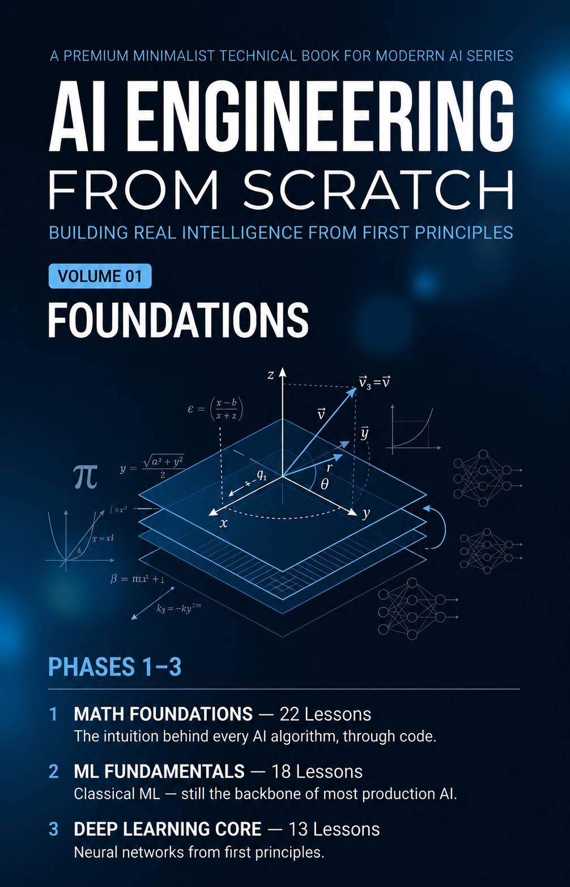

  

# AI Engineering From Scratch — Community Book Edition

> A professionally formatted unofficial community book edition of the open-source **AI Engineering From Scratch** project. 

---

## Overview

This repository provides a printable book edition of the excellent open-source project:

**AI Engineering From Scratch**

created by **Rohit Ghumare**.

The purpose of this project is to improve the reading experience by providing:

- Professional typography
- Print-ready PDF
- Better page organization
- Additional flowcharts
- Visual explanations
- Offline reading experience

This repository **does not replace** the original project. Instead, it complements it.

---

## Volume 1

  

### Foundations

Covers:

- Mathematical Foundations
- Machine Learning Fundamentals
- Deep Learning Core

---

## Downloads

Download the latest version:

- 📄 [Volume 1 — Foundations (PDF)](https://github.com/kourosh07/AI-Engineering-From-Scratch-Books-edition/blob/main/volumes/Volume-01-Foundations.pdf)

---

## Original Project

Original repository:

https://github.com/rohitg00/ai-engineering-from-scratch

Please support the original author by starring the repository.

---

## Attribution

This edition incorporates material from the open-source project:

AI Engineering From Scratch

Copyright (c) 2026 Rohit Ghumare

Licensed under the MIT License.

The original copyright notice and the MIT License are included in this repository.

---

## Original Contributions

This edition adds:

- Professional book formatting
- Layout design
- Typography
- Flowcharts
- Additional diagrams
- Navigation improvements
- Print optimization

The educational content remains the work of the original author.

---

## Roadmap

- ✅ Volume 1 — Foundations
- 🚧 Volume 2 — Perception & Language
- 🚧 Volume 3 — Advanced AI

---

## License

See LICENSE and THIRD_PARTY_LICENSES.md.
